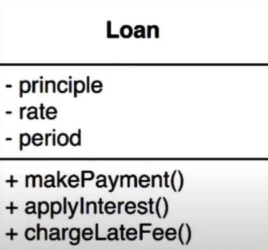
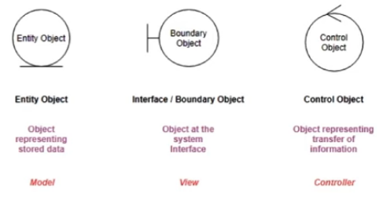

# Arquitetura Limpa: Estruturando Aplicações com Profissionalismo - Otávio Lemos

### Valores de um software

* Funcionalidade -> entregar comportamentos

* Estrutura -> Design, Arquitetura

### Consequências de negligenciar a arquitetura de um software

> "Se a arquitetura vem depois, o sistema ficará cada vez mais caro de desenvolver e eventualmente mudanças serão praticamente impossíveis para partes ou todo o sistema."

### Conceitos de arquitetura de software

* **Regras de negócio**

  * **Definição** 
  
    * É a lógica de um sistema, a razão dele existir

    * Deve ser independente de agentes externos (banco de dados, UI, frameworks) -> maior flexibilidade

  * **Exemplo**: função do Gmail é mandar email, portanto "mandar email" é a razão dessa aplicação existir (regra de negócio)

* **Regras de negócio de domínio**

  * É a parte mais importante de um software

  * É independente de software

    > **Software**: é responsável por automatizar as regras de negócio

  * Essa lógica é implementada na entidades de domínio

* **Entidade de domínio**

  

  * **Definição**: `dados críticos + regras de negócio (comportamentos) = entidade`

    * **OBS**: na programação orientada a objetos: `dados críticos = propriedades` / `regras de negócio = métodos` / `entidade = objeto`

  * **Exemplo**

    * **Entidade** = empréstimo

    * **Dados críticos** = valor do empréstimo, taxa de juros, período de pagamento

    * **Regras de negócio** = fazer pagamento, aplicar juros, multar pagamento atrasado 

* **Regras de negócio de aplicação**

  * São regras voláteis, ou seja, podem mudar de aplicação para aplicação

  * São operação de alto nível (manipular os objetos de domínio)

  * Essa lógica é implementada nos casos de uso (*use cases*)

### Ideias arquiteturais que baseou a Arquitetura Limpa

* **Ports and adapters**

  

* **Data, context and interaction (DCI)**

  

* **Boundary, control and Entity (BCI)**

  

  * Analogia à arquitetura MVC

    * Control = Controllers

    * Entity = Model

    * Boundary = View (interface entre a controlador e a entidade)

### Arquitetura Limpa

* **Entities**: dados críticos e regras de negócio do domínio

* **Use cases**: regras de negócio da aplicação

* **Controllers, Gateways, presenters**: adaptadores de interface (abstrações), uma ponte entre o "mundo externo" e os casos de uso (*use cases*)

* **Web, UI/Device, external interfaces, DB**: implementação dos adaptadores utilizando dependências externas (frameworks, banco de dados, etc)

* **Regra de dependência**: as camadas internas não devem conhecer diretamente as camadas mais externas