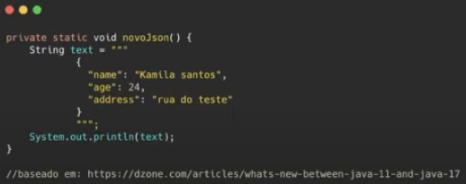

as# O Futuro do Java - Kamila Santos

### Novidades do Java 17

* **Sealed classe (classe selada)**

  * Veio do JEP 409

  * Restringir quais classe podem herdar de uma classe mãe, ou seja, as classes só serão estendidas pelas classes que tiverem permissão para isso (`permission`)

  * Modificador `sealed`: tornar uma classe selada

  * Cláusula `permission`: especificar as classes que têm permissão para estender uma classe selada

  * **Exemplo**

    

* **Pattern Matching for switch** (preview)

  * Tornar as instruções `switch` muito mais programáveis e flexíveis, permitindo a implementação de padrões nos blocos `case` do `switch`

  * Essa funcionalidade está disponível apenas para tipos numéricos, `enum` e `String`

  * **OBS**: é possível apenas testar igualdades exatas em relação às constantes

  * É possível tratar de modo mais simples condições de valores nulos (`null`)

    * **Sem Pattern Matching**

      

    * **Com Pattern Matching**

      

### Mudanças entre as versões LTS: Java 11 e Java 17

* **Triple quotes**

  * Facilitar a manipulação de String, principalmente ao escrever uma String JSON

  * Java 11

    

  * Java 17

    

* **Records**

  * Criar classes imutáveis e com a geração automática de construtores, getters, setters, equals e hashcode

  * Java 11

    * Era necessário crias todos esses métodos manualmente ou via IDE

    * Utilização da biblioteca **Lombok**

  * Java 17

    

* **Stream to List**

  * Conversão um Stream para uma List

  * Java 11

    

  * Java 17

    

### Spring Native

* Utilização de imagens nativas

* Vantagens das imagens nativas

  * Menor consumo de memória
  
  * Inicialização mais rápida

  * Obtenção de código executável por meio da compilação AOT (*Ahead of Time*)

    > **OBS**: a compilação padrão do Java é a JIT (Just in Time)

  * Análise de modo estático todas as dependências, libs, jdk, etc, por meio do Graal VM

  * Geração de um executável, através da compilação antecipada (AOT), é realizado o descarte de metadados desnecessários para o funcionamento da aplicação

* **OBS**: outros frameworks como *Helidon*, *Micronaut* e *Quarkus* já ofereciam essa tecnologia

### Spring Fu

* Projeto em experimentação

* É uma incubadora para o JaFu (Java DSL) e o KoFu (Kotlin DSL) projetada para configurar o Spring Boot explicitamente com código, de forma declarativa e com o auxílio do preenchimento automático

* **Vantagens**

  * Inicialização rápida (40% para rápido do que aplicação com Spring MVC)

  * Baixo consumo de memória

  * **GraalVM nativo** proporcionando uma abordagem quase sem a presença de **reflections** do Java (o que trás uma certa lentidão à aplicação)

### Spring Retrosocket

* Provê uma experiência parecida com o *Feign* e o *Retrofit* de forma declarativa baseado *Rsocket*