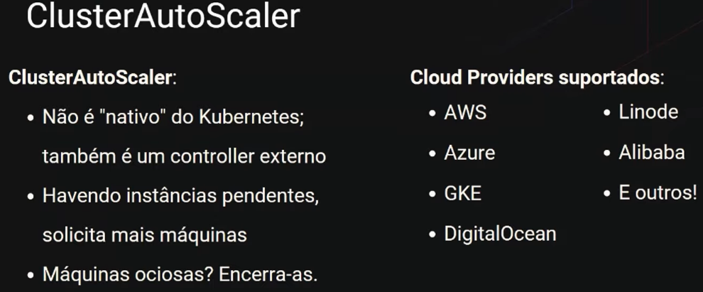

# Por que Kubernetes? - Marcelo Andrade

### Kubernetes

> "Kubernetes é uma plataforma de código aberto, portável e extensiva para gerenciamento de cargas de trabalho e serviços distribuídos em containers, que facilita tanto a configuração declarativa quanto automação." - [Mantenedores](https://kubernetes.io/pt-br/docs/concepts/overview/what-is-kubernetes/)

* **Definição**: é um framework de infraestrutura **para containers**, **declarativo** (arquivos `.yaml`) e operado de maneira **autónoma** por meio dos *controllers*

* **Exemplo**

  

### Controllers

* **Definição**: implementam o "**como**"

* **Função**

  * Acompanham o estado atual do que está em execução no momento

  * Caso tenha divergência entre o estado atual e o ideal/desejado, é executado operações que aproximam o estado atual do desejado (processo chamado de **reconciliação**)

* **Características**

  * **Modelo descentralizado**

    * Não é uma entidade única, podem existir *controllers* externos (no Kubernetes 1.21: 38 controllers nativos -> cada um exercendo uma função afim de garantir o estado deseja)

    * Não é a ação de um *controller* que resolve um problema, cada um tenta aproximar o estado atual do desejado "fazendo a sua parte"

### Imperativo VS Declarativo

* **Imperativo**

  * Define o **como**

  * Instruções para atingir um objetivo

* **Declarativo**

  * Define o **quê**

  * Descreve o estado final desejado

  * Abstrai o "**como** fazer"

### Papel do IT

* **Dev**

  * **Função**: produzir e evoluir sistemas

  > "Develop and evolve"

* **Ops**

  * **Função**: excelência operacional -> executar, implantar e manter sistemas

    * **Excelência operacional consiste em**:

      * Implantações bem sucedidas

      * Alta disponibilidade

      * Escalabilidade

      * Segurança

  > "Deploy and maintain"

### Timeline de serviços de implantação

* **2000 - Hardware não virtualizado**

  * `1 host = 1 sistema operacional`

  * Servidor de propósito definido: banco de dados ou aplicação

  * Instalação e configuração manual (possuía "Documentos de configuração")

  * Pouca automação, muitos operadores -> complexidade elevada e alto custo

* **2001 - Virtualização**

  * `1 host = dezenas de máquinas virtuais`

  * Otimização do uso de servidores físicos

  * Aumento da complexidade

    * Atualizações de sistemas

    * Deploy de workloads

    * Backups

* **2013 - Containers**

  * `1 host = centenas (ou milhares) de containers`

  * Processos isolados

  * Execução no próprio host (virtual ou não)

  * "Explosão" de complexidade

  * **Características**

    * Portabilidade

    * Agilidade

    * **Eficiência**

      * **Recursos**: menos *overhead*, mais densidade

      * **Dev**: otimização do ciclo de desenvolvimento

      * **Ops**: excelência operacional

    * Flexibilidade

    * Segurança

    * Inicialização mais rápida

    * Entrega rápida

    * Gerenciabilidade

    * Operações mais confiáveis

    * Escalabilidade

  * **Problemas que os containers ainda não resolvem**

    > São o **quê**, não o **como**

    * **Para Ops**

      * Implantações bem sucedidas

      * Alta disponibilidade

      * Escalabilidade

      * Segurança

    * **Para Devs**

      * Interface

### Containers

* **Viabilizam implantações bem sucedidas**

  * Imagens de containers garantem eficiência na entrega da aplicação

  * Inibem dependências ausentes ou incorretas

  * Evitam conflitos entre programas/bibliotecas

* **Descrevem a aplicação a ser implantada**

### Declarativo

* **Viabiliza implantações bem sucedidas**

  * Descreve cada aspecto externo ao container necessário para sua viabilização

  * Parâmetros e configurações

  * Integração e regas de acesso

* **Descreve a infraestrutura a ser usada**

### Controllers

* **Viabilizam alta disponibilidade**

  * Falhas afastam o cluster do estado desejado (Exemplos: falha na aplicação, travamento no host)

  * **Reiniciam aplicações falhas** e **reinstanciam cargas em outros hosts** afim garantir o estado desejado no cluster

* **Viabilizam escalabilidade**

  * Basta declarar novamente no objeto declarativo, o número de instâncias, e então os *controllers* atuarão até chegar nesse novo estado desejado

  * O Kubernetes também tem a função de controlar a quantidade de instâncias de acordo com a demanda, basta declarar isso no manifesto

### Kubernetes

* **Viabiliza a *interface***

  > "É uma framework **declarativo** para **containers** operado de maneira autónoma por ***containers*** que viabiliza a **interface** entre as equipes de **desenvolvimento** e da **infraestrutura** que hospedará suas aplicações"

* **Alta disponibilidade**

  

  

  

  > Auto diagnóstico
  

  > Load Balancer
  

* **Escalabilidade**
  
  

  

  